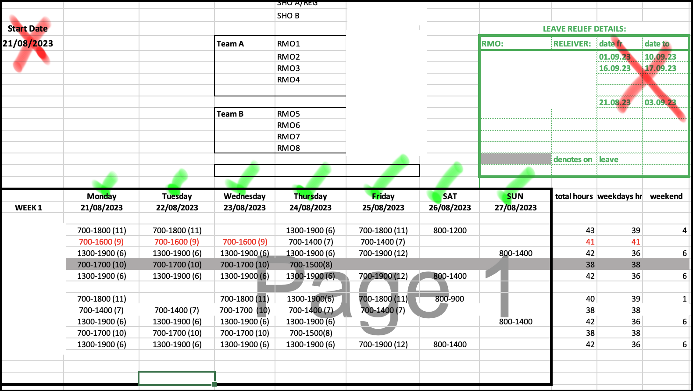

# Roster Functions

This details important overview information about the ingestRoster() and its helper functions

## Scope

Covers the following functions within `PayslipFunctions.py`

- [IngestRoster()](#ingestroster)
    - [ingestTypeA()](#ingesttype)
    - [ingestTypeB()](#ingesttype)
    - [ingestTypeC()](#ingesttype)
    - [dateValidTypeA()](#datevalidtypea)
    - [dateValidTypeB()](#datevalidtypeb)
    - [dateValidTypeC()](#datevalidtypec)
    - [parseDate()](#)
    - [parseHours()](#)

## IngestRoster()

**Usage**

`IngestRoster(fileName, findName, rosterFormat, startDate, endDate)`

**Arguments**

- `fileName` (string) - the full system path to the file in question. Accepted file types: .xlsx
- `findName` (string) - the EXACT name of the employee as it appears in fileName
- `rosterFormat` (string, options="A", "B", "C") - defines the structure of the roster file (see below)
- `startDate` (datetime obj) - the start of the date range the function will return. (Inclusive)
- `endDate` (datetime obj) - the end of the date range the function will return. (Inclusive)

**Output**

Returns a dictionary with dates as keys, and strings of the worked shift as the value.

```json
{
	"2023-08-21": "1300-1900",
    "2023-08-22": "1300-1900",
    "2023-08-23": "1300-1900",
    "2023-08-24": "1300-1900",
    "2023-08-25": "0700-1900",
    "2023-08-27": "0800-1400"
}
```

**Helper functions**

- `ingestType*()` - the main algorithm for each roster format A, B, and C.
- `dateValidType*()` - used to verify if a potential date found in the spreadsheet should actually be used to look for data cells (semantically valid). Three different functions for roster formats A, B, and C.
- `parseDate()` - used to check if a string is a technically valid date (i.e. fits the correct character pattern)
- `parseHours()` - used to check if a string is a technically valid set of hours (i.e. fits the correct character pattern)

## ingestType*()

**Usage**

`ingestType*(sheet, findName)`

**Arguments**

`sheet` (pyopenxl sheet object) - the sheet that cell is contained in.
`findName` (string) - as above, the EXACT name of the employee as it appears in fileName

**Output**

Returns a dictionary in the same format as mentioned in IngestRoster()'s output.

**Type A Algorithm**

TODO

**Type B Algorithm**

1. Create a dictionary called tempDates, containing entries `{date (string):cell (pyopenxl obj)}`
    - dates are sanitised into a standard format (see parseDate)
    - semantic validity of dates is confirmed and non-valid dates are skipped (i.e. do these cells containing dates actually need to be checked against a name to collect an hours-string, or do they represent a random date included in the sheet for another reason)

    e.g. 
    ```json
    {
        "2023-08-21":<Cell 'Sheet1'.B2>
        "2023-08-22":<Cell 'Sheet1'.B3>
        "2023-08-23":<Cell 'Sheet1'.B4>
        ...
    }
    ```

2. Create a list called tempNameRows, containing the row number (as a string) for each instance of findName in the sheet.
    - No validity checking is done as it's not required.

    e.g. `['12', '18', '24' ...]`

3. Iterate through these lists to create entries into outputDict of the format `{date (string):hours worked (string)`
    - hours are sanitised into a standard format (see parseHours)
    - because Type B rosters expand/stack downwards, further logic is included to ensure the correct name-row is linked with the correct date cell. This logic is a check to ensure the name-row about to be added is the first name-row AFTER the date-row also about to be added. (Take a read through the code as this is moderately confusing)

4. outputDict now contains every valid shift listed for that employee in the roster, so it is trimmed using the startDate and endDate values.

5. The dictionary outputDict is returned.

**Type C Algorithm**

Because Type C rosters are just an axis-flipped version of Type B ones, this algorithm is very similar to the Type B one with only minor differences.

- the names of some of the variables are slightly different (e.g. `tempNameCols` instead of `tempNameRows`)
- the order in which the main list/dictionary is created is inverted.
- Note: less rigorous checking of valid dates in this algorithm. See `dateValidTypeC()`


## dateValidTypeA()

**Usage**

`if dateValidTypeA(cell, sheet):`

**Arguments**

`cell` (pyopenxl cell object) - the cell whos value is the potential date in question.
`sheet` (pyopenxl sheet object) - the sheet that cell is contained in.

**Output**

TODO

## dateValidTypeB()

**Usage**

`if dateValidTypeB(cell, sheet):`

**Arguments**

`cell` (pyopenxl cell object) - the cell whos value is the potential date in question.
`sheet` (pyopenxl sheet object) - the sheet that cell is contained in.

**Output**

Returns `True` or `False` according to the following algorithm:

1. Look at the cells BELOW the cell in question. Do they contain a string that looks like a set of hours for a shift? (e.g. "0800-1800"). If yes, this is a valid cell. If they contain a string that is NOT a valid set of hours (e.g. a date, other text), it is NOT a valid cell. If they are empty, move on to (2).
2. Look at the cells LEFT and RIGHT of the cell in question. Do these contain a string that looks like a date? If EITHER of them do, this is a valid cell (as some dates will be on the end of a row).

The quantity of cells to check for (1) is defined as the marginValue, and can be modified if the algorithm is missing/including dates incorrectly.

## dateValidTypeC()

**Usage**

`if dateValidTypeC(cell, sheet):`

**Arguments**

`cell` (pyopenxl cell object) - the cell whos value is the potential date in question.
`sheet` (pyopenxl sheet object) - the sheet that cell is contained in.

**Output**

Returns `True` or `False` according to the following algorithm:

1. Look at the cells ABOVE and BELOW of the cell in question. Do these contain a string that looks like a date? If EITHER of them do, this is a valid cell (as some dates will be on the top/bottom of a column).

Recently removed check on RIGHT-ward cells containing hours as they falsely flagged cells containing "OFF" (instead of empty cells) as being invalid candidates for a date-adjacent cell. This is not correct, but making "OFF" equivalent to empty is not yet practical.

## A Note on dateValid Functions

These functions aim to select cells from the roster spreadsheet containing dates that are ONLY located in a roster "block".



Unfortunately this does still allow through some cells containing dates that aren't specifically part of the roster. Examples of this include dates indicating leave periods, or the titles that include dates etc.

Thankfully, a vast majority of these abberantly included dates will actually result in NO incorrectly added shifts in the output. This is because most of the time, when cross-referenced with the employee name, they won't be in line with a valid shift time. (As is the case in the image above).

## parseHours